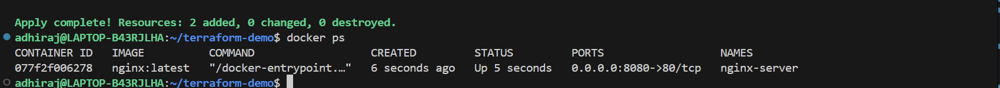

# terraform-demo
 Provision a local Docker container using Terraform.

1. Created a Terraform configuration (main.tf)

    Used the Docker provider.

    Pulled the nginx:latest image.

    Created a container named nginx-server exposing port 8080.

2. Initialized Terraform

terraform init

3. Planned the deployment

terraform plan

4. Applied the configuration

terraform apply

    Confirmed with yes to create the container.

5. Verified the container is running

docker ps

    Confirmed that nginx-server is up and listening on port 8080.

6. Checked Terraform-managed resources

terraform state list

7. Destroyed the container and image

terraform destroy

**Proof that Container has been created** 

